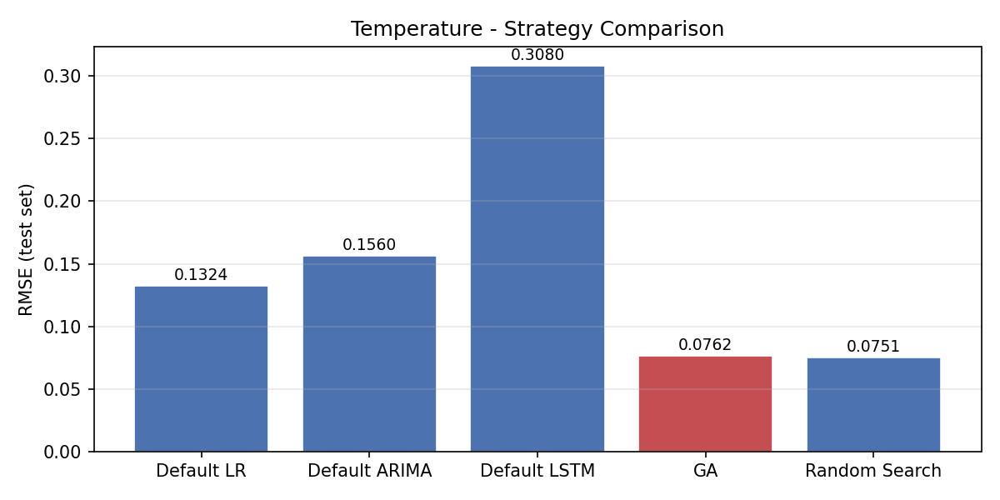
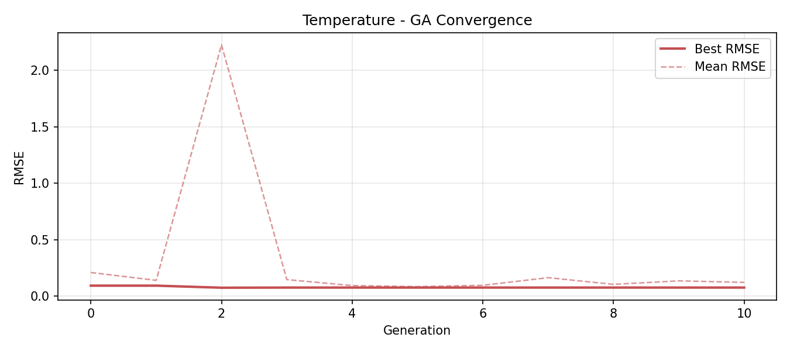
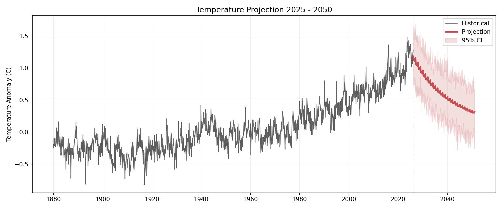

# Multi-Model Climate Forecasting with Genetic Algorithm-Based Model Selection and Hyperparameter Optimization

**CS5100 - Foundations of Artificial Intelligence**
Aniket Nandi, Akshay Ashok Bannatti
---
## Overview
This project applies a Genetic Algorithm (GA) to jointly select and tune forecasting models for three climate indicators:
- **Global surface temperature anomaly** (NASA GISS)
- **Atmospheric CO2 concentration** (NOAA Mauna Loa)
- **Mean sea level change** (CSIRO/NOAA global + Indian Ocean sub-regions)

Each GA chromosome encodes a complete modelling pipeline (model type + hyperparameters).
The GA evolves optimal configurations through tournament selection, type-aware crossover, and parametric/structural mutation.
---
## Results

Both GA and random search cut RMSE by **24–75%** compared to untuned default models, across all six series.

| Indicator | GA RMSE | Random Search RMSE | Best Default RMSE |
|---|---|---|---|
| Temperature | 0.0762 | 0.0751 | 0.1324 |
| CO2 | 0.3163 | 0.2974 | 0.7792 |
| Sea Level (Global) | 2.1934 | 1.9838 | 2.6057 |
| Sea Level (Indian Ocean) | 2.3164 | 2.2338 | 2.7360 |
| Sea Level (Bay of Bengal) | 2.2471 | 2.3273 | 2.9184 |
| Sea Level (Arabian Sea) | 2.1479 | 1.9756 | 2.5536 |

**Key findings**
- **Automated search beats manual defaults by a wide margin.** Hyperparameter choice has a large effect on forecast accuracy.
- **Seasonal ARIMA dominates.** Both search strategies converged on seasonal ARIMA for every series. LSTMs were penalized for complexity and struggled with only a few hundred monthly observations.
- **Random search matched the GA at this budget.** With 100 evaluations (pop = 10, gens = 10), random search won on 5 of 6 series, by margins of 1.4–9.6%. The GA's advantage is expected to appear at larger budgets.





> Projections are illustrative outputs of the statistical pipeline, not physical climate forecasts.

📄 Full write-up: [Final Paper](Aniket_Akshay_Final_Paper.pdf)
---
## Project Structure
```aiignore
GA Climate Prediction Project/
|--- data/
|     |--- loaders.py   # For data loading & preprocessing of all 3 datasets
|--- models/
|     |--- statistical.py   # Linear Regression + ARIMA wrappers
|     |--- lstm_model.py    # LSTM wrapper (TF/Keras, with Ridge fallback)
|--- ga/
|     |--- chromosome.py    # Chromosome encoding + mutation + complexity penalty
|     |--- crossover.py     # Type-aware uniform crossover
|     |--- engine.py    # Full GA engine (selection, evolution, logging)
|     |--- random_search.py     # Random search baseline (equivalent budged)
|--- utils/
|     |--- visualise.py     # Plotting helpers
|--- notebooks/
|     |--- climate_forecasting_ga.ipynb     # Main notebook
|--- results/   # Auto-created; stores PNGs and JSON summaries
|--- main.py    # CLI pipeline
|--- requirements.txt
```
---
## Quick Start
```bash
# 1. Install dependencies
pip install -r requirements.txt

# 2. Run via CLI (single indicator)
python main.py --indicator temperature --pop 10 --gens 10 --seed 42

# 3. Run all indicators
python main.py --all --pop 10 --gens 10

# 4. Fast run
python main.py --all --pop 2 --gens 2

# 5. Or open the notebook
jupyter notebook notebooks/climate_forecasting_ga.ipynb
```

### CLI Options
Flag -> Default -> Description

`--indicator` -> `temperature` -> `temperature`, `co2`, `sea_level`, or `all`

`--pop` -> `30` -> GA population size

`--gens` -> `50` -> Number of generations

`--seed` -> `42` -> Random seed

`--region` -> `global` -> Sea-level region (`global`, `indian_ocean`, `bay_of_bengal`, `arabian_sea`)

`--quiet` -> off -> Suppress per-generation output

---
## GA Design
Component -> Detail

**Chromosome** -> model_type {LR, ARIMA, LSTM} + full hparam dict

**Fitness** -> `1 / (RMSE + complexity_penalty)` - higher is better

**Selection** -> Tournament selection (k = 3)

**Crossover** -> Type-aware uniform crossover; cross-type parents preserve model integrity

**Mutation** -> Parametric (per-gene swap, rate = 0.2) + structural (model-type switch, rate = 0.05)

**Elitism** -> Top-2 individuals carried forward unchanged

---
## Outputs (in `results/`)
- `{indicator}_fitness.png` - GA convergence curve
- `{indicator}_diversity.png` - population model-type share over generations
- `{indicator}_comparison.png` - RMSE bar chart: defaults vs GA vs random search
- `{indicator}_forecast.png` - actual vs predicted on the test set
- `{indicator}_projection.png` - 2025 – 2050 forecast with 95% CI
- `{indicator}_summary.json` - best hyperparameters and all RMSE values
